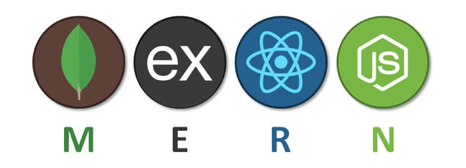

# Google Books Search Engine Refactored with GraphQL

  
## Table of Contents

* [Description](#description)
* [Installation](#installation)
* [Usage](#usage)
* [Contribution](#contribution)
* [Testing](#testing)
* [Questions](#questions)
* [Licensing](#licensing)

## Description

This project is a refactored version of a fully functioning Google Books API search engine built with a RESTful API, using a GraphQL API built with Apollo Server. The application is built using the MERN stack with a React front end, MongoDB database, and Node.js/Express.js server and API. The user can search for books and save them to the back end.

The goal of this project is to demonstrate the ability to set up an Apollo Server to use GraphQL queries and mutations to fetch and modify data, replacing the existing RESTful API. The authentication middleware has been modified to work in the context of a GraphQL API. An Apollo Provider is also implemented so that requests can communicate with the Apollo Server.

The application is deployed on Heroku with a MongoDB database using MongoDB Atlas. Use the Deploy with Heroku and MongoDB Atlas walkthrough for instructions.

Overall, this project showcases the importance of data and user demands in modern web development, and how refactoring to a GraphQL API can improve performance and scalability.

Deployed Project: https://floating-caverns-38393.herokuapp.com/
   
 
 

## Installation

You'll need [Node.js](https://nodejs.org/) and [MongoDB](https://www.mongodb.com/)

Then:
-  start:   node server/server.js,
-  develop: "concurrently \"cd server && npm run watch\" \"cd client && npm start\"",
-  install: "cd server && npm i && cd ../client && npm i",
-  seed:    "cd server && npm run seed",
-  build:   "cd client && npm run build"

## Usage

Install packages
- `npm run install`

Seeding the database is available but optional
- `npm run seed`

Start the client and server
- `npm run develop`

## Contribution

Follow the "fork-and-pull" Git workflow.

  1. **Fork** the repo on GitHub
  2. **Clone** the project to your own machine
  3. **Commit** changes to your own branch
  4. **Push** your work back up to your fork
  5. Submit a **Pull request** so that we can review your changes

NOTE: Be sure to merge the latest from "upstream" before making a pull request!

## Testing
  
N/A

## Questions

Feel free to contact me with any questions or comments:  
<donovan.courtney@gmail.com>  
<https://github.com/decourtney>

## Licensing

Code and Docs released under [MIT License](https://choosealicense.com/licenses/mit/).
